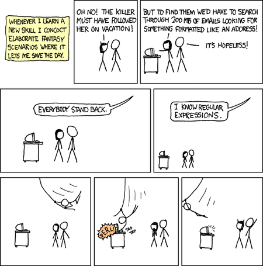

<style>
.forceBreak { -webkit-column-break-after: always; break-after: column; }
</style>

```{r setup, include=FALSE}
knitr::opts_chunk$set(echo = FALSE)
knitr::opts_chunk$set(tidy.opts=list(width.cutoff=60),tidy=TRUE)
```

## Regular Expressions {.columns-2 .smaller}


<p class="forceBreak"></p>

- A 'language' to represent text patterns - concept invented in the 1950's
- Bound by a set of rules (syntax); a set of special characters used to denote patterns
- Multi-platform: available (natively or through libraries) in many languages and tools (R, Python, Java, sed, awk)
- Use cases: 

    + read files with a specific naming pattern, e.g. 20190114_Mon_P1_W08_R2.csv, 20190114_Mon_P10_W01_R3.csv
    + search for text patterns
    + replace text patterns

## The basics

+ Character classes `[]`

    + any character: `.`
    + alphabet: `[A-Z]` or `[:upper:]`, `[a-z]` or `[:lower:]`, `[A-Za-z]` or `[:alpha:]`
    + numeric: `[0-9]` or `[:digit:]` or `\d`
    + alphanumeric: `[A-Za-z0-9]` or `[:alnum:]`
    + whitespace (space, tab, linebreak): `\s`

+ quantifiers:

    + one or more (of the preceding character): `+`
    + zero or more: `*`
    + zero or one: `?`
    + specified number: `{m,}`, `{m,n}`
    
## The basics

+ anchors:
  
    + start: `^` (except in the context of `[^ ]`, where it is negation)
    + end: `$`
    
+ capture groups:
    
    + extract groups: `()`
    + refer to captured groups: `\1`, `\2`, etc.
+ metacharacters: `. \ | ( ) [ { ^ $ * + ? ,` 

## Examples

+ https://regexr.com/
+ in the string "the cat in the hat has a bat":

    + `[ch]at` matches `cat` and `hat`
    + `.at` matches `cat`, `hat` and `bat`
    + `.{2}` matches `in`
    + `[:alpha:]{1,2}` matches `in` and `a`
    + `.\s.` matches `e c`, `t i`, `n t`, `e h`, `t h`, `s a`, `a b`
    
## Strings in R

- Strings ("character" class) are represented in R using " or '
- But what about special characters like newlines and tabs? They are represented as escape sequences.`print` prints the escape sequence, whereas `cat` processes them.
```{r strings, echo = TRUE}
string = "First\tline\nSecond\tline"
print(string)
```
```{r, echo = TRUE}
cat(string)
```

## Strings in R
- What if the string contains an invalid escape character?
```{r, echo = TRUE, error=TRUE, results='asis'}
regex_string = ".\s."
```
- Regular expressions are represented as strings in R. But strings are processed first for escape characters. Unrecognised escape characters in strings throw an error, before even reaching the regex parser. 
- Double backslahes needed for regex escape sequences 
```{r, echo = TRUE, error=TRUE, results='asis'}
regex_string = ".\\s."
string = "the cat in the hat has a bat"
regexpr(regex_string, string)
```
## Two problems
Some people, when confronted with a problem, think "I know, I'll use regular expressions." Now they have two problems. - Jamie Zawinski


## Base R functions that use regex

+ `grep()`
+ `grepl()`
+ `regexpr()`
+ `gregexpr()`
+ `sub()`
+ `gsub()`

+ `strsplit()`
+ `list.files()`

## Stringr functions

As with other Tidyverse functions, Stringr functions take the *text* as the first argument and the pattern as the second argument

+ `str_locate()` - like `regexpr()`, but returns an integer matrix
+ `str_detect()` - like `grepl()`
+ `str_split()` - like `strsplit()`
+ `str_extract()` - like `match = regexpr(pattern, string); substring(string, match, match + attr(match, "match.length") - 1)`

## Test drive


```{r, echo = TRUE}
library(babynames)
library(stringr)
library(dplyr)
library(ggplot2)
library(ggpubr)
babynames %>%
  group_by(name, sex) %>%
  summarise(n = sum(n)) -> sum_babynames

sum_babynames %>%
  filter(str_detect(name, "a$")) %>%
  group_by(sex) %>%
  count() %>%
  ggplot(aes(x = sex, y = nn, fill = sex)) + 
    geom_col(colour = "black") +
    labs(title = "Names ending with 'a'") +
    theme_pubr(border = TRUE)
    
babynames %>%
  filter(str_detect(name, "a$")) %>%
  group_by(sex, year) %>%
  count() %>% 
  ggplot(aes(x = year, y = nn, colour = sex)) + 
    geom_line() +
    labs(title = "Names ending with 'a'") +
    theme_pubr(border = TRUE)
```
```{r, echo = TRUE}
sum_babynames %>%
  filter(str_detect(name, "[aeiou]$")) %>%
  group_by(sex) %>%
  count() %>%
  ggplot(aes(x = sex, y = nn, fill = sex)) + 
    geom_col(colour = "black") +
    labs(title = "Names ending with vowel") +
    theme_pubr(border = TRUE)

babynames %>%
  filter(str_detect(name, "[eiou]$")) %>%
  group_by(sex, year) %>%
  count() %>% 
  ggplot(aes(x = year, y = nn, colour = sex)) + 
    geom_line() +
    labs(title = "Names ending with a vowel other than 'a'") +
    theme_pubr(border = TRUE)
```
```{r, echo = TRUE}
sum_babynames %>%
  filter(str_detect(name, "(.{2})\\1")) %>%
  group_by(sex) %>%
  #filter(sex == "M") %>%
  count() %>% 
  #print()
  ggplot(aes(x = sex, y = nn, fill = sex)) + 
    geom_col(colour = "black") +
    labs(title = "Names with repetitive characters") +
    theme_pubr(border = TRUE)
```
```{r, echo = TRUE}
sum_babynames %>%
  filter(str_detect(name, "[HhZz]ero")) %>%
  group_by(sex) %>%
  #filter(sex == "M") %>%
  #count() %>% 
  print()
  #ggplot(aes(x = sex, y = nn, fill = sex)) + 
    #geom_col(colour = "black") +
    #labs(title = "Names with repetitive characters")
    #theme_pubr(border = TRUE)
```
```{r, echo = TRUE}
babynames %>% group_by(year) %>% count() -> babynames_pop
left_join(babynames, babynames_pop, by = "year") -> babynames_complete

babynames_complete %>%
  filter(str_detect(name, "^[^AEIOUaeiou]+$")) %>%
  group_by(sex, year) %>% 
  summarise(n = sum(n/nn)) %>%
  #count() %>% 
  ggplot(aes(x = year, y = n, colour = sex)) + 
    geom_line() +
    labs(title = "Names without any vowels") +
    theme_pubr(border = TRUE)
```
```{r, echo = TRUE}
babynames %>%
  filter(str_detect(name, "^Joshua$")) %>%
  group_by(sex, year) %>% 
  #count() %>% head()
  ggplot(aes(x = year, y = n, colour = sex)) + 
    geom_line() +
    labs(title = "") +
    theme_pubr(border = TRUE)
```
## Commenting within a regex
